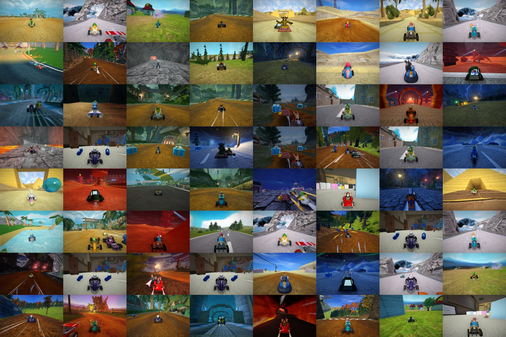
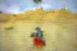
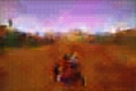
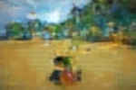
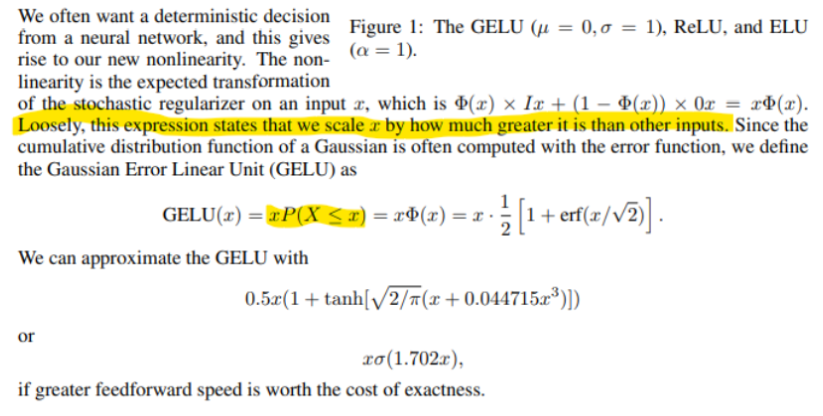
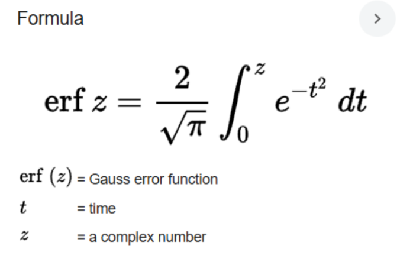

# Binary Spherical Quantization (BSQ) Autoencoder and Autoregressive Image Generation Model (PyTorch)   

- sample images after going through BSQ autoencoder (encoded, quantized, then reconstructed using decoder)

- sample generated images from taking zero-noise of quantized patches of images, acquiring the logits among vocabulary of 2^10 codebook bits to represent each image patch, using autoregressive model and  ...

## Architecture
### BSQ Auto-Encoder
- Encoder
  - The encoder continually increases the embedding dimension (last dim) and the superseding dimensions decrease (heigh and width), so continually larger subsections of the image are represented with larger embeddings using logits from previous layers -> receptive field increases to extract higher level features in the image
  - convolution operation
    - element wise multiplication and summation to get a scalar. Kernel window's weights are the same ... Advantage compared to linear layer operation ....  
- Binary Spherical Quantizer
  - 
- Decoder
  - Learns to rebuild original image from latent space encoder representation. Because our autoregressive model's vocabulary are integers from our BSQ's codebook bits latent space, the purpose of the decoder here is to provide the pixel representation of the generated logits from the BSQ latent space

Auto Encoder Layers (builds a deeper learned representation/understanding of input)
- Conv2d()
  - Channels: 3 to 128
  - Kernel size 25x25
  - Stride 25
  - Height and width goes from 150x100 to 6x4 -> relatively small bc want to build representations within those patches of the image
- Conv2d()
  - Channels 128 to 128
  - Kernel 3x3
  - Stride 1 -> stride being = kernelsize//2 -1  = 1 prevents height and width from shrinking
  - Height and width stays as 6x4
  - GELU non linear
    - https://pytorch.org/docs/stable/generated/torch.nn.GELU.html
    - 
      - Remember integral of a continuous random variable gives the probability mass within the range of the integral (here is [0,z])   
    - https://arxiv.org/pdf/1606.08415
    - Note the cdf of a gaussian is often computed with the error function:
    - 

Understanding Convolution being done:
- torch.nn.Conv2d(in_channels, out_channels, kernel_size, stride=1, padding=0, dilation=1, groups=1, bias=True, padding_mode='zeros', device=None, dtype=None)

- Patchify Linear
    - torch.nn.Conv2d(3, latent_dim, patch_size, patch_size, bias=False)
        - input to this layer will be (channel x height x width) -> can assume actual size is (batch x c x h x w)
            - which is why in forward() we make sure input to conv is cxhxw
            - Then notice after conv operation in forward(), convert to channel last (hxwxc)
            - This is bc: 
               - Pytorch adpoted channel first (c x h x w) -> so this is expected dim for pytorch
               - But, deep networks that use channel last are FASTER (h x w x c)
        - increase channels from 3 -> latent_dim=128
        - the patch_size=25 params correspond to kernel_size and stride
        - kernel_size corresponds to window size during conv operation (25x25)
        - stride is how many pixels we're skipping as we perform conv operation on kernel window
            - bc stride=25 and kernel_size=25, we're practically only performing conv operation on "patches" of an image
            - ex: think of a 50x50 image (height x width), by having stride=25 and kernel_size=25, we have 4 patches/quadrants of the image that we convolute on
        - outputsize after single one of these conv layers
            - Ex: if input is 3x150x100 (channel x h x w)
            - new_channels=128
            - new_height=((150-25 + 2*0)/25)+1=6
            - new_width=((100-25 + 2*0)/25)+1=4
        - So we end up with a 128x6x4 encoded image that we'll feed through a non linear layer

Auto Decoder Layers
- ConvTranspose2d()
  - Channel 128 to 128
  - Kernel size 3x3
  - Stride and padding of 1 -> having padding of 1 prevents height and width from increasing
  - Height and width 6x4 -> 6x4
  - GELU 
- ConvTranspose2d()
  - Channel 128 to 3 -> original # channels
  - Kernel 25x25
  - Stride 25
  - Height and width 6x4 -> 150x100 -> back to original hxw

- torch.nn.ConvTranspose2d(in_channels, out_channels, kernel_size, stride=1, padding=0, output_padding=0, groups=1, bias=True, dilation=1, padding_mode='zeros', device=None, dtype=None)

First ConvTranspose2D layer in decoder
- new_height=(S*(I-1)+K-2P+O) = (1*(6-1)+3-(2*1)+0) = 8-2 = 6
- new_width=(1*(4-1)+3-(2*1)+0) = 6-2 = 4

- Unpatchify Linear (second convTranpose())
    - torch.nn.ConvTranspose2d(latent_dim, 3, patch_size, patch_size, bias=False)
        - Reverts our output from Patchify Linear to original dimensions (batch x 3 x 150 x 100)
        - ConvTRANSPOSE() allows us to upscale width and height
            - input is (batch x 128 x 6 x 4) (batch x channel x height x width) 
            - channel reduced: 128 -> 3
            - the patch_size params correspond to kernel_size and stride
            - new_height=(S*(I-1)+K-2P+O) = (25*(6-1)+25-(2*0)+0) = 150
            - new_width=(25*(4-1)+25-(2*0)+0) = 100
            - so we end up with original dimension: batch x 3 x 150 x 100
        - again in forward() after perform conv layer, put back into channel last (hxwxc)

Height and Width Transformation after Conv or Convtranspose layers:

 Output size (height x width) after conv layer = ((Input size-Kernel size + 2*Padding)/Stride) +1
- Remember, channel after conv layer determined by out_channels parameter in Conv2d()

Output Size after convTRANSPOSE layer =(S*(I-1)+K-2P+O)  , S=Stride, I=InputSize, K=KernelSize, P=Padding, O=OutputPadding

### Autoregressive Model

## Pipeline
....
